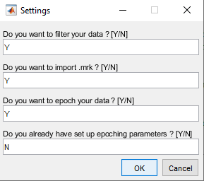
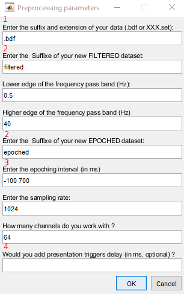
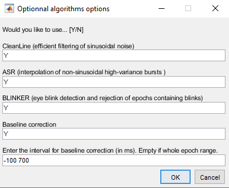
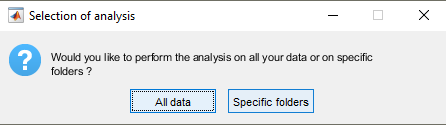
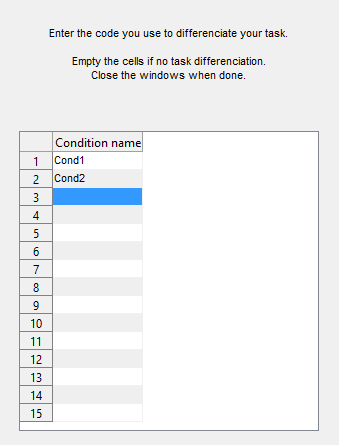
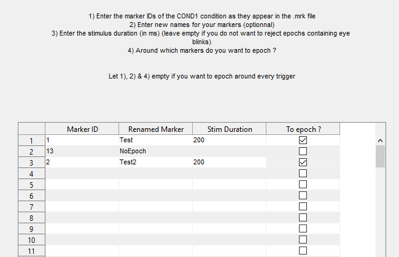
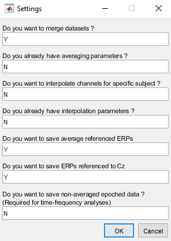
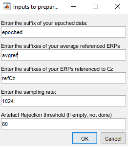
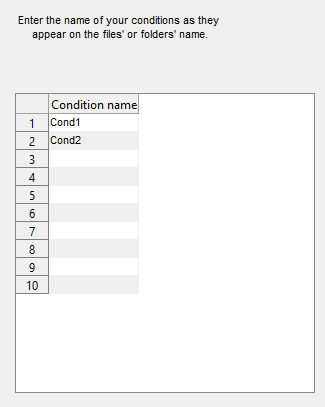

# User Manual

## 1. Filtering_epoching.m

**⚠️ Keep the defaults values if you don't know what you are doing!**

### 1.1 Settings

With your raw EEG files (.bdf or .set 64 channels only), you will need to:

1) Filter their signals

2) Re-specify their trigger (accept inputs from .mrk files)

3) Epoch them based on your design.

This first prompt allows you to indicate to the script which of these three steps you want to do. Keep in mind that everything is skippable to allow flexibility.

In your first run, you should not have any epoching parameters. These parameters will create themselves after our first epoching.

### 1.2 Parameters

This second prompt contains all the basic parameters for the steps you choose.
Thus, if you decided to not filter your data on the last prompt, the question of the frequency band pass will not be displayed.

1) For the extension of your data, you may enter a suffix with the extention. Ex: *"Cond1.bdf"*. In this case, only the bdf files finishing by *"Cond1"* will be loaded.

2) After filtering, a filtered .set copy of your files will be saved with this suffix to their name.
With the default value, your filetered files will be named *FileName_filtered.set*.
The same logic is applied for the saved epoched files.

3) The lower and upper thresholds of the epoching interval. With the default values, the epoch will include 100ms pre-stimuli, and 700ms post-stimuli.
**A space needs to be input between the two values.**

4) If there is a trigger delay between the trigger and the real display on the subject screen, you can correct it here.

### 1.3 Algorithms options

Three external algorithms are implemented in this filtering pipeline in addition to the baseline correction. Links can be found in the Dependencies section of the [README.md](README.md).
CleanLine to efficiently filter and remove sinusoidal noise.
ASR to clean non-sinusoidal high-variance bursts.
BLINKER to detect and reject epochs containing an eye blink during stimulus display.

In case you choose to not filter or epoch during the [settings prompt](#11-settings), this prompt might differ.

### 1.4 Files path

1) The script will then ask you to select the folder containing all the files you want to load. **It does not matter if this folder contains sub-folders.
It will take that into account and copy the folder-tree when saving the filtered and epoched .set files.**
It will search for the files finishing by what you input in the first line of the [parameters prompt](#12-parameters).

2) In the same fashion, if you decided to re-specify your triggers based on .mrk files, it will ask you the folder there are in.
**The script will automatically link the .mrk files to their raw counter-part based on their names.
The file names need to be identical. If not, the .mrk files that could not be found by the script will be listed in the log.txt file at the end of processing.**

3) Enter the folder where you want you filtered and epoched file to be saved.
These files will have the same names and sub-folder tree as your raw files, but with the suffix you input during the [parameters prompt](#12-parameters).

### 1.5 Subject specific analyses

You can decide to only choose some files to pre-processed. It can be useful if you decide to include one or two participants more after the first analyses, or if you had a problem on one specific file.

If you choose the specific files option, a prompt will be displayed asking you to tick the files you want to run the script on.

### 1.6 Epoching parameters

If you decided to import .mrk files and/or to epoch your data, a series of prompt will arrive to know your conditions and their triggers' caracteristics. 
**When you are done, simply close the prompt to go to the next one.**

In the first prompt, the script is asking you if you have different conditions within your files. Each condition names as they appear on your files need to be written on separeted lines. It will treat every condition separetly, with different triggers' caracteristics.

If you don't have conditions or if the conditions are identical in terms of events and do not need to be differenciated, empty the cells.

**⚠️ Please, do not use recursive condition names in your nomenclature. Ex: "CondAB" and "CondA". Or condition names repeating another code. Ex: "Sbj12_2_CondSbj". In these cases, the script might give you a prompt warning you of your bad nomenclature.**

In this prompt, you will need to list the trigger name in the first column **as they appear in the raw file, or as they appear in the .mrk file if you re-triggered the event**, how you want them to be renamed in the second, their duration in the third to indicate when to remove the epoch in the presence of an eye-blink (conditional to the [BLINKER algorithm](#13-algorithms-options)), and a tick if you want to epoch the event or just erase it.

This prompt will be shown for every condition you entered in the last prompt. Thus, if you have three conditions, the prompt will be displayed three times for each of them. If you have none, only one will appear.

After these, you will have to choose where you want the parameters to be saved (default name "Marker_Parameters.mat"). It will allow us to load these parameters the next time you run the script on the same dataset by saying 'Y' in the last line of the [settings prompt](#11-settings).

### 1.7 Output files

That's it ! Your files are ready to be filtered, re-triggered, and epoched.

At the end of processing, a log.txt file is created where your files are saved. It shows all the details of what was done during the processing. Additionnaly, a to_interpolate.csv file is created at the same place. It will allow us later on to indicate to the [ERPs.m](ERPs.m) script which channels are to be interpolated. Do not touch it at the moment.

## 2 Comp_ICA.m

*To be written.*

## 3 ERPs.m

Now that we have filtered and epoched data, we can pre-process the signal a tad bit more with artefact rejections and bad channels rejections before computing their Evoked Response Potentials referenced to Cz or average referenced.

The averaging for ERP computation is compatible to all designs as long as you have a coherent nomenclature to support it. It means the conditions' name need to be written in the same way somewhere on all files' name or in a sub-folder.

### 3.1 Settings

In this first prompt, you will tell the script what you want to do.

First, do you want to merge datasets ? In the case you have several files for a same subject in a same condition, you can say 'Y' to have all the same-subject and same-condition files to be loaded and merged together in one whole file. It can be useful if you stoped your recording and saved two separated files during your experiment for example.

On the first run, you should not have averaging parameters. This is a system akin to the [epoching parameters](#16-epoching-parameters).

You can also want to interpolate bad channels. If 'Y', the indicated bad channels will be ignored for the artefact rejection and then interpolated using multi-quadratic interpolation. The link to this interpolation algorithm is in the Dependencies section of the [README.md](README.md).

If you write having *Interpolation parameters*, the script will ask you for the *to_interpolate.csv* file created at the end of the epoching. In this file, you have one row for each subject at each condition. You need to indicate their bad channels by putting their channel numbers in the next columns in the same fashion as the first example line. **Do not delete the first example line !** If you say not having *Interpolation parameters* but still ask to interpolate, a table where you need to tick all the bad channels will be displayed (very slow and tedious; not adviced method).

The next two lines ask if you want your ERPs referenced to Cz and/or average referenced ERPs. 

The last line ask you if you want to save the signal just before the averaging. In this case, you will have epoched data pre-processed through artefact rejection and interpolation, but not averaged into ERPs.

### 3.2 Parameters

In this prompt, the script asks you for the suffix of your epoched data to know which files to load, akin to what is done in the filtering_epoching script's [second prompt](#12-parameters). It also asks you which suffix you want to add to the final ERP files.

The artefact rejection means that all epochs containing one frame over the input threshold (80uV by default) will be excluded. If you don't want to use this method, erase the line's value.

#### 3.3 Files path

1) The script will then ask you to select the folder containing all the epoched data you want to load. **It does not matter if this folder contains sub-folders.
It will take that into account and copy the folder-tree when saving the final ERP files.**
It will search for the files finishing by what you input in the first line of the [parameters prompt](#32-parameters).

2) Enter the folder where you want you filtered and epoched file to be saved.
These files will have the same names than your loaded epoched files, but with the suffix you input during the [parameters prompt](#32-parameters). The folder-tree will rearranged to follow a classification by condition and event averaging.

### 3.4 Subject specific analyses

Same as [section 1.5](#15-subject-specific-analyses).

### 3.5 ERPs parameters

The script will first ask you for the marker_parameters.mat that have been saved during your first epoching run (see [section 1.6](#16-epoching-parameters)) to give you the table of the triggers' name you used during epoching. It is purely there to help you recall which names you gave to your triggers, you can skip this help by closing the window.

**_For each of the following prompt, close the window to continue._**

Same logic as in the [epocing parameters](#16-epoching-parameters). Write the condition names you used in your nomenclature in each line of this prompt.
If you don't have conditions in your design, delete the default cells' value.
